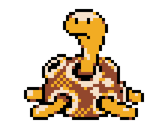

## The Shuckle Programming Language
**Shuckle** is a small statically typed, S-expression programming language.

## Example:
```clj
(function (main i32)
    ("hello!" print)
    0
)
```

## License
This is distributed under the [**Zlib License**](https://opensource.org/licenses/Zlib). See [**LICENSE**](https://github.com/ryaangu/shuckle/blob/main/LICENSE) for more details.
